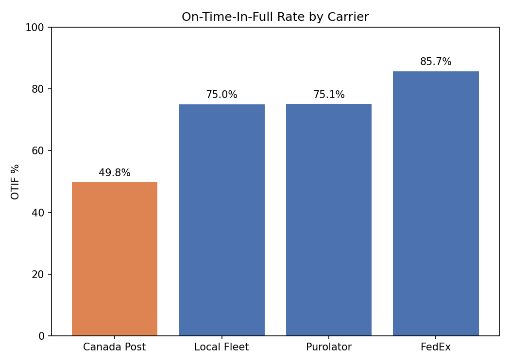
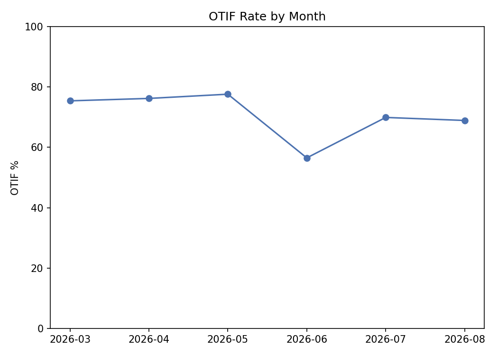

# Order Fulfillment SQL Analysis

A SQL-based analysis of order fulfillment performance across a simulated retail supply chain — calculating fill rate, on-time delivery, and OTIF (on-time-in-full) from a relational database, then isolating which carrier is driving missed deliveries.

## What it does

- **Relational data model** — 5 linked tables (`Products`, `Customers`, `Orders`, `Order_Lines`, `Shipments`) built in a SQLite database, modeling a realistic order-to-delivery flow: 320 orders, 901 order lines, across 15 customers and 4 carriers.
- **Fulfillment KPI calculation** — SQL queries using multi-table `JOIN`s and `CASE WHEN` logic calculate fill rate (was the full quantity shipped?), on-time rate (did it arrive by the promised date?), and OTIF — the standard on-time-in-full metric used across supply chain and logistics operations.
- **Carrier performance breakdown** — a `GROUP BY` query isolates each carrier's on-time and OTIF performance separately, to find which one is actually causing missed deliveries rather than treating "late shipments" as one undifferentiated problem.
- **Monthly trend analysis** — date-based grouping (`strftime`) tracks OTIF performance month over month to spot shifts worth investigating further.

## Result

Across 320 orders, overall performance came in at **86.3% fill rate, 81.7% on-time rate, and 71.0% OTIF**. Breaking this down by carrier pinpointed the cause: **Canada Post's on-time rate is 57.6%, far below the 75-95% range of the other three carriers**, dragging its OTIF down to 49.8% versus 75-86% elsewhere — despite handling only about a quarter of all shipments. The monthly view also shows OTIF dipping to 56.5% in June, a signal that would be worth cross-checking against carrier mix or order volume for that period in a real operation.

## Tools

SQL (SQLite via Python's `sqlite3`), Python (pandas for querying and analysis, matplotlib for visualization), Google Colab / Jupyter Notebook.

## About the data

Uses the same 30-product catalog as my [Inventory Forecasting & Reorder-Point Dashboard](../inventory-forecasting-dashboard) and [Warehouse Slotting & Pick-Path Optimization](../Warehouse-Slotting-Pick-Path-Optimization) projects, extended to the order-to-delivery side of supply chain rather than replenishment timing or warehouse layout. Customers, orders, order lines, and shipments are synthetic, built to reflect realistic order volumes, occasional partial shipments, and carrier-specific delivery performance gaps.

## Files

| File | Description |
|---|---|
| `order_fulfillment_sql_analysis.ipynb` | The full analysis notebook — database setup, SQL queries, and charts |
| `Products.csv`, `Customers.csv`, `Orders.csv`, `Order_Lines.csv`, `Shipments.csv` | Source data: the 5 linked tables |
| `otif_by_carrier.png` | Bar chart comparing OTIF rate across carriers |
| `otif_by_month.png` | Line chart of OTIF rate by month |

## Author

Mohamed Seddik Nakbi
[linkedin.com/in/mohamed-seddik-nakbi-74640035b](https://linkedin.com/in/mohamed-seddik-nakbi-74640035b)
